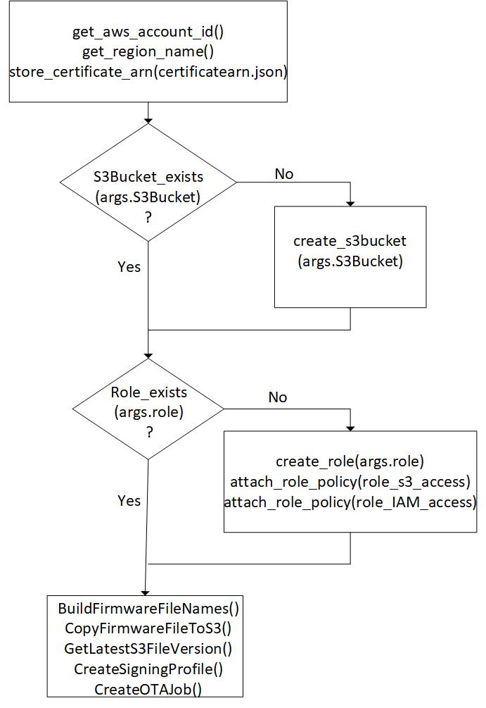

# AWS IoT and FreeRTOS for PSoC 6 MCU: OTA

This code example demonstrates Over-the-Air (OTA) firmware update of PSoC® 6 MCU running FreeRTOS. This example bundles two applications:

- **Bootloader app:** Implements an MCUboot-based basic bootloader application run by the CM0+ CPU. The bootloader handles image authentication and upgrades. When the image is valid, the bootloader lets the CM4 CPU boot/run the image by passing the starting address of the image to it.  See the [MCUboot-based Basic Bootloader](https://github.com/cypresssemiconductorco/mtb-example-psoc6-mcuboot-basic) example first to understand the basics.

- **OTA app:** This application executed by the CM4 CPU connects to the network and establishes an MQTT connection to the AWS MQTT broker. The OTA Agent on the IoT device regularly checks for an OTA update job notification. Once the device is notified about the update, the device submits a request to download the firmware image. The AWS server streams the update, which is then stored locally on the device, verified with a code-signing certificate, and the firmware updated.

[Provide feedback on this Code Example.](https://cypress.co1.qualtrics.com/jfe/form/SV_1NTns53sK2yiljn?Q_EED=eyJVbmlxdWUgRG9jIElkIjoiQ0UyMjg5MDUiLCJTcGVjIE51bWJlciI6IjAwMi0yODkwNSIsIkRvYyBUaXRsZSI6IkFXUyBJb1QgYW5kIEZyZWVSVE9TIGZvciBQU29DIDYgTUNVOiBPVEEiLCJyaWQiOiJzYmtyIiwiRG9jIHZlcnNpb24iOiIxLjAuMCIsIkRvYyBMYW5ndWFnZSI6IkVuZ2xpc2giLCJEb2MgRGl2aXNpb24iOiJNQ0QiLCJEb2MgQlUiOiJJQ1ciLCJEb2MgRmFtaWx5IjoiUFNPQyJ9)

## Requirements

- [ModusToolbox® software](https://www.cypress.com/documentation/software-and-drivers/modustoolbox-software-archives) v2.1

- Programming Language: C

- [ModusToolbox FreeRTOS SDK](https://github.com/cypresssemiconductorco/amazon-freertos)

- [Cypress Programmer](https://www.cypress.com/documentation/software-and-drivers/cypress-programmer-archive)

- [Python 3.8.3](https://www.python.org/downloads/release/python-383/)

- Associated Parts: All [PSoC® 6 MCU](http://www.cypress.com/PSoC6) parts with FreeRTOS support

Install the following additional software if you are using CMake. This code example was tested with CMake version 3.17.3 and Ninja version 1.10.0.

- [CMake](https://cmake.org/download/)

- [Ninja](https://ninja-build.org/)

**Notes:**
   1. *openssl*, which is used for generating private keys and signing certificates, is provided as part of the ModusToolbox installation at *C:/Users/\<user_profile_name>/ModusToolbox/tools_2.1/modus-shell/bin*.

   2. The python module *imgtool*, which is used for signing the image to include the header needed by the bootloader for authenticating the image, is provided as part of the *amazon-freertos* repository at *\<amazon-freertos>/vendors/cypress/MTB/port_support/ota\scripts*.

## Supported Toolchains (make variable 'TOOLCHAIN')

- GNU Arm® Embedded Compiler v7.2.1 (`GCC_ARM`) - Default value of `TOOLCHAIN`

**Note:** ModusToolbox FreeRTOS SDK supports Arm compiler v6.11 and IAR C/C++ compiler v8.42.2 toolchains, but MCUboot supports the GCC_ARM compiler only.

## Supported Kits (make variable 'TARGET')

**Note:** This example requires PSoC 6 MCU devices with at least 2 MB flash and 1 MB SRAM. Therefore, only the following kits are supported:

- [PSoC 6 Wi-Fi BT Prototyping Kit](https://www.cypress.com/CY8CPROTO-062-4343W) (`CY8CPROTO-062-4343W`) - Default value of `TARGET`

- [PSoC 62S2 Wi-Fi BT Pioneer Kit](https://www.cypress.com/CY8CKIT-062S2-43012) (`CY8CKIT-062S2-43012`)

## Hardware Setup

This example uses the board's default configuration. See the kit user guide to ensure that the board is configured correctly.

## Software Setup

Install a terminal emulator if you don't have one. Instructions in this document use [Tera Term](https://ttssh2.osdn.jp/index.html.en).

### Configure Python 3.8.3

1. Install [Python 3.8.3](https://www.python.org/downloads/release/python-383/) if you don't have it installed on your PC.

2. Change your directory to *\<amazon-freertos>/projects/cypress/afr-example-ota/ota_cm4/scripts*.

3. Install the packages listed in *requirements.txt*.
    ```
    pip install -r requirements.txt
    ```
**Note:** *\<amazon-freertos>* refers to the path of the FreeRTOS directory in your computer.

### Configure AWS CLI

AWS CLI is installed as part of the steps in the [Configure Python 3.8.3](#configure-python-3.8.3) section. This example requires AWS CLI to be configured on the local machine to start the OTA update job.

1. Enter the following command to configure your Identity and Access Management credentials with AWS CLI:
   ```
   aws configure --profile <name_of_profile>
   ```
   If no profile name is provided, the credentials are stored with the profile name as `default`.

2. Enter your Access Key ID, AWS Secret Access Key, Region, and Output format.

   Ensure that you have the Access Key ID and AWS Secret Access Key details or ask your AWS account administrator.

   - See [Region and Availability Zones](https://docs.aws.amazon.com/AmazonRDS/latest/UserGuide/Concepts.RegionsAndAvailabilityZones.html) to find the list of available regions.

   - See [CLI usage output](https://docs.aws.amazon.com/cli/latest/userguide/cli-usage-output.html) to find the supported output formats.

 **Note:** You can also submit the OTA job manually through the web console. See the "OTA Update Prerequisites" and "OTA Tutorial" sections in [FreeRTOS Over-the-Air Updates](https://docs.aws.amazon.com/freertos/latest/userguide/freertos-ota-dev.html) documentation.

## First Steps

1. Clone recursively or download the FreeRTOS SDK from [GitHub](https://github.com/cypresssemiconductorco/amazon-freertos):

   ```
   git clone --recursive https://github.com/cypresssemiconductorco/amazon-freertos.git --branch 202007-MTBAFR2041
   ```
2. Go to *\<amazon-freertos>/projects/cypress* directory. Clone or download this code example, or copy it if you already have it.
    ```
    git clone https://github.com/cypresssemiconductorco/afr-example-ota.git --recurse-submodules --branch latest-v1.X
    ```
   Alternatively, you can clone the example outside of the *\<amazon-freertos>* directory. However, you must make sure that `CY_AFR_ROOT` in *bootloader_cm0p/shared_config.mk*, and `AFR_PATH` in *ota_cm4/CMakeLists.txt* point to the correct path of the *\<amazon-freertos>* directory.

   If you use Eclipse IDE for ModusToolbox, you must clone the code example under *\<amazon-freertos>/projects/cypress* because Eclipse project files use relative paths to link to the files under *\<amazon-freertos>*.

3. Connect the board to your PC using the provided USB cable through the KitProg3 USB connector.

4. Open a terminal program and select the KitProg3 COM port. Set the serial port parameters to 8N1 and 115200 baud.

## Using the Code Example

This document expects you to be familiar with MCUboot and its concepts. See [MCUboot documentation](https://juullabs-oss.github.io/mcuboot/) to learn more.

This example bundles two applications - the bootloader app run by CM0+ and the OTA app run by CM4. You need to build and program the applications in the following order. Do not start building the applications yet: follow the [Step-by-Step Instructions](#step-by-step-instructions).

1. *Build and program the bootloader app* - On the next reset, CM0+ runs the bootloader and prints a message that no valid image has been found.

2. *Build and program the OTA app (factory image)* - On the next reset, the bootloader will let CM4 run the OTA app from the primary slot. This application connects to an AP, and then connects to the AWS MQTT broker and registers for OTA notifications. If `BLINK_FREQ_UPDATE_OTA` is 0 (default), the LED blinks at 1 Hz.

3. *Build the OTA app by changing the value of `BLINK_FREQ_UPDATE_OTA` and incrementing the application version in include/aws_application_version.h.* - Upload the signed image to AWS S3 Bucket and start an OTA job using *scripts/start_ota.py*. The device downloads the update image to the secondary slot and resets itself. The bootloader app then copies the image to the primary slot and enables the CM4 CPU to start executing from the primary slot. This application connects to an AP and establishes a connection with the AWS MQTT Broker. If the application version was higher, the device updates the status of the OTA job as successful in AWS, and registers for OTA notifications. The LED blinks at 4 Hz if `BLINK_FREQ_UPDATE_OTA` is 1.

## Step-by-Step Instructions

### Configuring bootloader_cm0p

#### ***Memory Layout***

Note that MCUboot and the OTA application must have the same understanding of the memory layout. The default memory layout is specified in the file *\<amazon-freertos>/projects/cypress/afr-example-ota/bootloader_cm0p/shared_config.mk*.

If using the *make* build flow, the memory map is shared between the two projects through *shared_config.mk*. If you are using CMake, specify the memory layout in the *\<amazon-freertos>/vendors/cypress/boards/\<TARGET>/CMakeLists.txt* file.

#### ***Location of the Update Image***

The update image is stored in the secondary slot which can reside in either the internal flash or the external flash. The *bootloader_cm0p* project uses the external flash by default.

To override this setting, change the value of `USE_EXT_FLASH` to '0' in *\<amazon-freertos>/projects/cypress/afr-example-ota/bootloader_cm0p/shared_config.mk*.

### Building and programming bootloader_cm0p

#### ***Using Eclipse IDE for ModusToolbox:***

1. Go to **File** > **Import**.

2. Choose **Existing Projects into Workspace** under **General** and click **Next**.

3. Click the **Browse** button near **Select root directory**, choose the code example directory *\<amazon-freertos>/projects/cypress/afr-example-ota/bootloader_cm0p*, and click **Finish**.

4. Select the application project in the Project Explorer.

5. In the **Quick Panel**, scroll down, and click **bootloader_cm0p Program (KitProg3)**.

#### ***Using CLI:***

1. Open a CLI terminal and navigate to *\<amazon-freertos>/projects/cypress/afr-example-ota/bootloader_cm0p*.

2. From the terminal, execute the `make program` command to build and program the application using the default toolchain to the default target. You can specify a target and toolchain manually:

   ```
   make program TARGET=<BSP> TOOLCHAIN=<toolchain>
   ```
   Example:

   ```
   make program TARGET=CY8CPROTO_062_4343W TOOLCHAIN=GCC_ARM
   ```

### Configuring ota_cm4

Ensure that AWS CLI is set up as described in [Configure AWS CLI](#configure-aws-cli).

#### ***If you haven't created a Thing:***

1. Update *configure.json* in *\<amazon-freertos>/tools/aws_config_quick_start* with the following details:

   - Name of your Thing
   - SSID, password, and security details of the AP.

2. Open a command prompt and run the following command:
    ```
    SetupAWS.py setup
    ```
   Your details will be updated automatically in *aws_credential.h* and *aws_credentialkeys.h* at *\<amazon-freertos>/demos/include*.

3. Copy these files into *\<amazon-freertos>/projects/cypress/afr-example-ota/ota_cm4/include*.

#### ***If you already have created a Thing:***

1. Open *aws_credential.h* in *\<amazon-freertos>/projects/cypress/afr-example-ota/ota_cm4/include* and update the following:

   - SSID, password, and security details of your AP
   - Name of your Thing
   - Endpoint address

2. Open *aws_credentialkeys.h* in *\<amazon-freertos>/projects/cypress/afr-example-ota/ota_cm4/include* and update the security certificates for your Thing.

### Generate a Signing Key-Pair

The OTA job needs a signing profile to sign the image before streaming it to the kit. The signing process is handled by AWS.

Do the following to generate a new signing key-pair and register it with AWS:

1. Open a command prompt and change the directory to *\<amazon-freertos>/projects/cypress/afr-example-ota/ota_cm4/scripts*.

2. Generate the private key using the following command:
    ```
    openssl genpkey -algorithm EC -pkeyopt ec_paramgen_curve:P-256 -pkeyopt ec_param_enc:named_curve -outform PEM -out <filename>.pem
    ```
   Replace *\<filename>* with a name of your choice.

3. Create a new file named "cert_config.txt" in the same directory with the following contents. Modify *\<user_name>* and *\<domain>* to match your credentials.

    ```
    [ req ]
    prompt             = no
    distinguished_name = my_dn

    [ my_dn ]
    commonName = <user_name>@<domain>.com

    [ my_exts ]
    keyUsage         = digitalSignature
    extendedKeyUsage = codeSigning
    ```
4. Generate a code-signing certificate using the following command:
    ```
    openssl req -new -x509 -config cert_config.txt -extensions my_exts -nodes -days 365 -key <filename>.pem -out <filename>.crt
    ```
5. Paste the contents of *\<filename>.crt* in *aws_ota_codesigner_certificate.h* at *\<amazon-freertos>/projects/cypress/afr-example-ota/ota_cm4/include*.

   Follow the format explained in the file. This is used to verify the signature generated by AWS and streamed with the image to the kit.

6. Register the certificate and private key with AWS Certificate Manager (ACM).
    ```
    aws acm import-certificate --certificate fileb://<filename>.crt --private-key fileb://<filename>.pem --profile <profile_name> > ./certarn.json
    ```
    **Note:** Make sure that you include the output redirect symbol '>' between file names.

#### ***If you are building the factory image:***

No files need to be edited when building the factory image. The example distinguishes between update images through application version and the blinking rate of the LED. `APP_VERSION_MAJOR`, `APP_VERSION_MINOR`, and `APP_VERSION_BUILD` determine the application version. The blinking rate is 1 Hz or 4 Hz if the value of `BLINK_FREQ_UPDATE_OTA` is 0 or 1 respectively. The default values are as follows:

   - **Using Eclipse IDE for ModusToolbox or the 'make' Build System:**
     The application version and blinking rate are specified in *aws_application_version.h* at *afr-example-ota/ota_cm4/include* and the Makefile at *\<amazon-freertos>/projects/cypress/afr-example-ota/ota_cm4* respectively.

   - **Using the CMake Build System:**
     The default application version is set in *aws_application_version.h* at *afr-example-ota/ota_cm4/include*. The blinking rate is set by `BLINK_FREQ_UPDATE_OTA` in *CMakeLists.txt* in *afr-example-ota/ota_cm4*.

#### ***If you are building the update image:***

Increment the OTA update image version to replace the existing image. Alternate the value of `BLINK_FREQ_UPDATE_OTA` between successive OTA update images. This will change the blinking rate of the LED, thereby providing a visual indicator for a successful OTA update.

   - **Using Eclipse IDE for ModusToolbox or the 'make' Build System:**

      Set the the version of the example in *aws_application_version.h* and `BLINK_FREQ_UPDATE_OTA` in the Makefile.

   - **Using the CMake Build System:**

      Set the version of the example in *aws_application_version.h* and `BLINK_FREQ_UPDATE_OTA` in the command line as explained in [Using CMake](#using-cmake).

#### ***Application version when using a TAR archive (Optional)***

The example generates a TAR archive in addition to the binary signed image, which can be uploaded to AWS. If you are using the TAR archive for an OTA upgrade, you can make use of the feature to check for the application version before starting the download. Note that this requires that the version numbers here and in *aws_application_version.h* match. This will create compile warnings such as follows:
```
warning: "APP_VERSION_MAJOR" redefined
```

   - **Using Eclipse IDE for ModusToolbox or the 'make' Build System:**

      Set the the version of the example and `CY_TEST_APP_VERSION_IN_TAR` in the Makefile.

   - **Using the CMake Build System:**

      Set the version of the example and `CY_TEST_APP_VERSION_IN_TAR` by exporting them to the environment variable such as follows:

      ```
      export CY_TEST_APP_VERSION_IN_TAR=1
      export APP_VERSION_MAJOR=1
      export APP_VERSION_MINOR=2
      export APP_VERSION_BUILD=3
      ```

### Building and Programming ota_cm4

#### ***In Eclipse IDE for ModusToolbox:***

1. Go to **File** > **Import**.

2. Choose **Existing Projects into Workspace** under **General** and click **Next**.

3. Click the **Browse** button near **Select root directory**, choose the code example directory *\<amazon-freertos>/projects/cypress/afr-example-ota/ota_cm4*, and click **Finish**.

4. Select the application project in the Project Explorer.

5. In the **Quick Panel**, scroll down, and click **ota_cm4 Program (KitProg3)**.

   Do not program the binary if it is the OTA update image. Instead, build the application by clicking **Build ota_cm4 Application**.

To program a target board different from the default one defined using the `TARGET` variable in the Makefile, you need to generate the launch configurations for the new target. See [Running FreeRTOS Code Examples - KBA228845](https://www.cypress.com/KBA228845) for details.

#### **Using Command-line Interface (CLI):**

1. Open a CLI terminal and navigate to the code example directory.

2. From the terminal, execute the `make program` command to build and program the application using the default toolchain to the default target. You can specify a target and toolchain manually:

   ```
   make program TARGET=<BSP> TOOLCHAIN=<toolchain>
   ```
   Example:

   ```
   make program TARGET=CY8CPROTO_062_4343W TOOLCHAIN=GCC_ARM
   ```
3. Do not program the binary if it is the OTA update image. Instead, build the application using the default toolchain to the default target with the `make build` command. You can specify a target and toolchain manually:
   ```
   make build TARGET=<BSP> TOOLCHAIN=<toolchain>
   ```
   Example:

   ```
   make build TARGET=CY8CPROTO_062_4343W TOOLCHAIN=GCC_ARM
   ```

#### ***Using CMake:***

1. Run the following command from the code example directory to configure and generate CMake build files using Ninja as the generator, *\<amazon-freertos>/projects/cypress/afr-example-ota/ota_cm4*:

   ```
   cmake -DVENDOR=cypress -DBOARD=CY8CPROTO_062_4343W -DCOMPILER=arm-gcc -S . -B build -G Ninja -DCMAKE_TOOLCHAIN_FILE=../../../../tools/cmake/toolchains/arm-gcc.cmake -DAFR_TOOLCHAIN_PATH=<Path to GCC_ARM compiler bin directory> -DBLINK_FREQ_UPDATE_OTA=0
   ```

2. Optionally, change the  LED blink frequency by changing the value of `BLINK_FREQ_UPDATE_OTA` in CMake generate command in Step 1.

   **Notes:**

    - The post-build steps use `arm-none-eabi-objcopy` to convert *afr-example-ota.hex* to *afr-example-ota.bin*, which fails when using IAR or Arm toolchains. Therefore, add the path to the binary directory of the GNU installation on your PC to the `PATH` environment variable.

    - `AFR_TOOLCHAIN_PATH` is not required if you have already added the binary directory path of the compiler installation on your PC to the `PATH` environment variable.

3. After CMake has generated the configuration, run the following command:

   ```
   cmake --build ./build
   ```
   In the post-build step, *sign_ota_cm4.sh* is used to add the image magic in the image header field and convert the signed image to a *.bin* file, which should be uploaded to AWS.

4. Use [Cypress Programmer](https://www.cypress.com/products/psoc-programming-solutions) to program *afr-example-ota.hex*. The hex file is generated under *\<amazon-freertos>/projects/cypress/afr-example-ota/ota_cm4/build*.

**Note:** Do not program the binary if it is the updated version of the application.

## Operation

After the image is verified by the bootloader, the application starts executing. The application connects to the AP and establishes a connection to the AWS MQTT Broker. It waits for OTA job notifications. The LED on the board blinks at 1 Hz if `BLINK_FREQ_UPDATE_OTA` is '0'. A sample serial output terminal is shown in Figure 1.

**Figure 1. Factory Image Terminal Output**


1. Edit the version of the example and set `BLINK_FREQ_UPDATE_OTA` to '1' as described in [Configuring ota_cm4](#configuring-ota_cm4).

2. Build the update image as explained in [Building and Programming ota_cm4](#building-and-programming-ota_cm4).

3. Run the *start_ota.py* Python script at *\<amazon-freertos>/projects/cypress/afr-example-ota/ota_cm4/scripts* to create the OTA job. Replace *\<name_of_profile>*, *\<name_of_thing>*, *\<name_of_role>*, *\<name_of_s3_bucket>*, and *\<name_of_signing_profile>* to match your credentials.
    ```
    cd dev/amazon-freertos/projects/cypress/afr-example-ota/ota_cm4/scripts
    python3 start_ota.py --profile <name_of_profile> --name <name_of_thing> --role <name_of_role> --s3bucket <name_of_s3_bucket> --otasigningprofile <name_of_signing_profile> --appversion <version_in_the_form_3-2-1>
    ```
   Once the device receives an OTA notification, it requests the updated image. AWS creates a stream and transfers the image to the device.

**Figure 2. OTA Notification Terminal Output**


After the transfer of the image is completed, the following occur:

   - The OTA Agent on the device verifies the signature provided by AWS with the image.

   - The bootloader validates the image with the public key.

   - After successfully validating, the bootloader overwrites the image in the primary slot (which contains the factory image) with the secondary slot (which contains the update image).

   - The LED now blinks at 4 Hz. A sample serial output is shown in Figure 3.

**Note:** After booting the update image, the version of the image is checked by the OTA Agent. If the version is older than that of the factory image, the OTA Agent rejects the image and forces a reset of the device. Because the factory image is lost after overwriting, the device boots the update image again. **Therefore, you must ensure that the version of the update image is always newer than the factory image.**

**Figure 3. Running the Update Image**


## Design and Implementation

### Overview

As explained at the beginning of this document, this example bundles two applications - a bootloader app and an OTA app. The bootloader app and the OTA app need to be programmed only once. Subsequent updated images of the OTA app needs to be converted to either a BIN or TAR archive before uploading it to AWS. The conversion of the built ELF file to BIN or TAR files is handled as part of post-build step.

The MCUboot repo in [GitHub](https://github.com/JuulLabs-OSS/mcuboot/tree/master/boot/cypress) also includes two apps - MCUBootApp and BlinkyApp - for PSoC 62 devices. The functionality of the bootloader app is exactly the same as the MCUBootApp bundled with MCUboot; it reuses several source files (see *bootloader_cm0p/app.mk* for the exact list of files). This code example uses ModusToolbox resources such as BSPs and psoc6make to provide a rich development experience that aligns well with other ModusToolbox-based code examples.

**Figure 4. Bootloader App Flow**


In this example, the OTA app is always programmed to the primary slot and the update image is stored in the secondary slot. See [MCUboot design documentation](https://juullabs-oss.github.io/mcuboot/design.html) for details.

### Flash Map/Partition

Figure 5 shows a typical flash map or partition used with MCUboot. The partitions need not be contiguous in memory because it is possible to configure the offset and size of each partition. However, the offset and the size must be aligned to the boundary of a flash row or sector. For PSoC 6 MCUs, the size of a flash row is 512 bytes. Also, the partition can be in either internal flash or external flash.

The memory partition is described or defined through a flash map (a data structure). It is important that the bootloader app and the bootable app (i.e., OTA app in this example) agree on the flash map. This example uses a shared file (*bootloader_cm0p/shared_config.mk*) between the two apps so that they can use the same set of flash map parameters. See [Configuring the Default Flash Map](#configuring-the-default-flash-map) for details.

**Figure 5. Typical Flash Map**


#### ***Default Flash Map***

Figure 6 illustrates the default flash map used in this example.

- Placing secondary slots in external flash is supported when `USE_EXT_FLASH=1`.

- The starting address of the scratch area is:

   - `0x101D8000` when the secondary slot resides in the external flash.

   - `0x101FF000` when the secondary slot resides in the internal flash.

- The starting address of the secondary slot in the external flash is offset by 0x40000 (256 KB) because the erase sector size of the S25FL512S NOR flash (available on most PSoC 6 MCU kits) is 256 KB.

See [Bootloader App Variables](#bootloader-app-variables) for details on configuring these parameters.

**Figure 6. Default Flash Map in this Example**


#### ***Customizing the Flash Map***

A default flash map is defined through the `boot_area_descs` variable in the *libs/mcuboot/boot/cypress/cy_flash_pal/cy_flash_map.c* file; this variable is constructed using the macros defined in the *libs/mcuboot/boot/cypress/MCUBootApp/sysflash/sysflash.h* file.

You can either configure the parameters such as the bootloader size and slot size that constitute the default flash map or completely override the default flash map as described in the following sections.

##### *Configuring the Default Flash Map*

A simplified way to configure the default flash map is to configure the parameters in the *bootloader_cm0p/shared_config.mk* file. These are used to set the values of the macros in *sysflash.h* through the `DEFINES` variable in *bootloader_cm0p/Makefile*.

In this method, all the slots are set to the same size using the `MCUBOOT_SLOT_SIZE` variable. These parameters are also passed to the linker using the `LDFLAGS` variable; the linker scripts use those parameters and define the memory regions accordingly. See [Common Variables](#common-variables) for details on configuring these parameters. Figure 7 illustrates how the flash map configuration flows from the *shared_config.mk* file to other files.

**Figure 7. Flash Map Configuration**


##### *Overriding the Default Flash Map*

1. Add `DEFINES+=CY_FLASH_MAP_EXT_DESC` in *bootloader_cm0p/Makefile*.

2. Define and initialize the `struct flash_area *boot_area_descs[]`variable. The default definition of this variable is available in the *libs/mcuboot/boot/cypress/cy_flash_pal/cy_flash_map.c* file.

### Configuring make Variables

This section explains the important make variables that affect the MCUboot functionality. You can either update these variables directly in the Makefile or pass them along with the `make build` command.

#### ***Common Make Variables***

These variables are common to both the bootloader and OTA apps and are configured via the *bootloader_cm0p/shared_config.mk* file.

| Variable | Default Value | Description |
| -------- | ------------- |------------ |
| `USE_EXT_FLASH`        | 1             | When set to '1', the bootloader app supports placing the secondary slot on the external flash. |
| `MCUBOOT_IMAGE_NUMBER` | 1             | Number of images supported in the case of multi-image bootloading. This example supports only one image. |
| `SIGN_KEY_FILE`             | cypress-test-ec-p256 | Name of the private and public key files (the same name is used for both the keys) |
| `BOOTLOADER_APP_FLASH_SIZE` | 0x18000              | Flash size of the bootloader app run by CM0+. <br />In the linker script for the bootloader app (CM0+), `LENGTH` of the `flash` region is set to this value.<br />In the linker script for the OTA app (CM4), `ORIGIN` of the `flash` region is offset to this value. |
| `BOOTLOADER_APP_RAM_SIZE`   | 0x20000              | RAM size of the bootloader app run by CM0+. <br />In the linker script for the bootloader app (CM0+), `LENGTH` of the `ram` region is set to this value.<br />In the linker script for the OTA app (CM4), `ORIGIN` of the `ram` region is offset to this value and `LENGTH` of the `ram` region is calculated based on this value. |
| `MCUBOOT_SCRATCH_SIZE`      | 0x1000               | Size of the scratch area used by MCUboot while swapping the image between the primary slot and secondary slot |
| `MCUBOOT_HEADER_SIZE`       | 0x400                | Size of the MCUboot header. Must be a multiple of 1024 (see the note below).<br />Used in the following places:<br />1. In the linker script for the OTA app (CM4), the starting address of the`.text` section is offset by the MCUboot header size from the `ORIGIN` of the `flash` region. This is to leave space for the header that will be later inserted by the *imgtool* during post-build steps.  <br />2. Passed to the *imgtool* while signing the image. The *imgtool* fills the space of this size with zeroes (or 0xFF depending on internal or external flash) and then adds the actual header from the beginning of the image. |
| `MCUBOOT_SLOT_SIZE`         | 0x1C0000, when the secondary slot is placed in the external flash.<br /> 0xF3800, when the secondary slot is placed in the internal flash. | Size of the primary slot and secondary slot, i.e., the flash size of the OTA app run by CM4.<br /> `MCUBOOT_SLOT_SIZE` refers to sizes of both the primary and secondary slots in this example. |
| `MCUBOOT_MAX_IMG_SECTORS`   | 3584, when the secondary slot is placed in the external flash.<br /> 2000, when the secondary slot is placed in the internal flash.| The maximum number of flash sectors (or rows) per image slot or the maximum number of flash sectors for which swap status is tracked in the image trailer. This value can be simply set to `MCUBOOT_SLOT_SIZE/FLASH_ROW_SIZE`. For PSoC 6 MCUs, `FLASH_ROW_SIZE=512 bytes`.<br /><br />Used in the following places:<br />1. In the bootloader app, this value is used in `DEFINE+=` to override the macro with the same name in *mcuboot/boot/cypress/MCUBootApp<br />/config/mcuboot_config/mcuboot_config.h*.<br />2. In the OTA app, this value is passed with the `-M` option to the *imgtool* while signing the image. *imgtool* adds padding in the trailer area depending on this value. <br /> |

**Note:** The value of`MCUBOOT_HEADER_SIZE` must be a multiple of 1024 because the CM4 image begins immediately after the MCUboot header and it begins with the interrupt vector table. For PSoC 6 MCU, the starting address of the interrupt vector table must be 1024-bytes aligned.

`Number of bytes to be aligned to = Number of interrupt vectors x 4 bytes`

i.e., 1024 = 256 vectors x 4 bytes (32-bit address) per vector.

PSoC 6 MCU supports up to 240 external interrupts in addition to the 16 system exceptions provided by CM4. See the description of the CPUSS_CM4_VECTOR_TABLE_BASE register in [PSoC 6 Register Technical Reference Manual](https://www.cypress.com/documentation/technical-reference-manuals/psoc-6-mcu-psoc-62-register-technical-reference-manual-trm) and the description of the Vector Table Offset Register (VTOR) in Cortex-M4 (ARMv7-M) Architecture Technical Reference Manual for details.

#### Bootloader App make Variables

These variables are configured via *bootloader_cm0p/Makefile*.

| Variable             | Default Value | Description                                                  |
| -------------------- | ------------- | ------------------------------------------------------------ |
| `USE_CRYPTO_HW`        | 1             | When set to '1', Mbed TLS uses the Crypto block in PSoC 6 MCU for providing hardware acceleration of crypto functions using the [cy-mbedtls-acceleration](https://github.com/cypresssemiconductorco/cy-mbedtls-acceleration) library. This library is cloned as a sub-module within MCUboot.|

#### OTA App make Variables

These variables are configured via *ota_cm4/Makefile*. They are needed to demonstrate OTA upgrades.

| Variable       | Default Value    | Description    |
| -------------- | -----------------| ---------------|
| `BLINK_FREQ_UPDATE_OTA` | 0   | Valid values: 0, 1<br />**0:** The LED blinks at a rate of 1 Hz when this parameter is 0.  <br />**1:** The LED blinks at a rate of 4 Hz when this parameter is 1. <br />Change the definition of this build parameter between successive firmware upgrades to get a visual indication of successful OTA upgrade.|
| `OTA_USE_EXTERNAL_FLASH`  | `USE_EXT_FLASH` | It is set to the same value as `USE_EXT_FLASH`. Set this to '0' when the secondary slot of the image resides in the external flash. This affects the value used for padding by *imgtool*. The padding value is '0' for the internal flash and 0xff for the external flash. |

The following variables are not required to demonstrate OTA updates, but provide optional features that you can enable:

| Variable       | Default Value    | Description    |
| -------------- | -----------------| ---------------|
|`CY_TEST_APP_VERSION_IN_TAR`| 0 | If this is enabled, the application version in the TAR archive is checked before downloading. If the application version is older, it is not downloaded.
| `APP_VERSION_MAJOR`<br />`APP_VERSION_MINOR`<br />`APP_VERSION_BUILD` | 0.9.0 | The application version provided by the user is used if `CY_TEST_APP_VERSION_IN_TAR` is '1'. Ensure that the version matches with *aws_application_version.h*. It is passed to *imgtool* with the`-v` option in `MAJOR.MINOR.BUILD` format while signing the image. Ensure that the value of application version is incremented between successive firmware upgrades; otherwise, the OTA job will be marked as failed by the OTA Agent when the device executes the update image.|


### Secondary Slot on External Flash

This code example supports configuring the secondary slot (to place the upgradable image) on either the external flash or internal flash. You will have to decide the secondary slot location before starting the build. By default, the secondary slot is on the external flash. To change it to internal flash, set `USE_EXT_FLASH=0` in *afr-example-ota/bootloader_cm0p/shared_config.mk*. If you are using CMake to build, run the `export OTA_USE_EXTERNAL_FLASH=0` command.

**Note:** When the internal flash is selected for the secondary slot, the size of the application is restricted to 974 KB. As a result, the amount of memory available to you to add additional functionality to the OTA functionality is very low. Therefore, it is recommended to store the secondary slot in the external flash.

See the [MCUboot-based Basic Bootloader](https://github.com/cypresssemiconductorco/mtb-example-psoc6-mcuboot-basic) code example to learn more about MCUboot slots and upgrade processes.

### Security

**Note:** This example performs a rudimentary check of whether the correct `IMAGE_MAGIC` is present in the MCUboot header. It does not implement root of trust (RoT)-based secure services such as secure boot and secure storage (to securely store and retrieve the keys). You must ensure that adequate security measures are implemented in your end-product. See the [PSoC 64 Line of Secure MCUs](https://www.cypress.com/psoc64) that offer those advanced security features built-in, and read this [whitepaper](https://www.cypress.com/documentation/white-papers/security-comparison-between-psoc-64-secure-mcu-and-psoc-6263-mcu) that compares the security features between PSoC 64 Secure MCU and PSoC 62/63 MCUs.

This example disables image authentication by commenting the following lines in the *bootloader_cm0p/config/mcuboot_config/mcuboot_config.h* file:

```
#define MCUBOOT_SIGN_EC256
#define NUM_ECC_BYTES (256 / 8)
.
.
.
#define MCUBOOT_VALIDATE_PRIMARY_SLOT
```

### Pre- and Post-Build Steps

#### ***Bootloader App: Pre-Build Steps***

The pre-build steps are specified through the `PREBUILD` variable in *bootloader_cm0p/Makefile*. This step generates the *cycfg_qspi_memslot.c./h* files under the *bootloader_cm0p/COMPONENT_CUSTOM_DESIGN_MODUS/TARGET_\<kit\>/GeneratedSource* directory. This step is required because QSPI is not enabled in *design.modus*. This is done to avoid initializing the QSPI block in the generated source because it is initialized in SFDP mode by the bootloader app in *main.c*. *psoc6make* auto-generates the source files from the configurator tools only if the peripheral is enabled in *design.modus*.

#### ***OTA App: Post-Build Steps***

These steps generate a signed version of the image in HEX format using the *imgtool* Python module. The `CY_SIGNING_KEY_ARG` variable holds the arguments passed to the *imgtool*. The final image is in HEX format so that PSoC 6 MCU programmer tools can directly program the image into the device. Additionally, the signed hex files are converted to BIN format and TAR archives which is used to perform OTA upgrades.

   - **Using Eclipse IDE for ModusToolbox or the 'make' Build System:**

      The post-build steps are specified through the `POSTBUILD` variable in *ota_cm4/make_support/mtb_feature_ota.mk*. The step provides the file names and signing arguments to the bash file *sign_script.bash* at *\<amazon-freertos>/vendors/cypress/MTB/port_support/ota/scripts*, which does the following:

       1. Converts the generated ELF file to a HEX file i.e., *ota_cm4.unsigned.hex*.

       2. Signs *ota_cm4.unsigned.hex* using the *imgtool.py* script. The signed HEX file, *ota_cm4.hex*, is used to program the device.

       3. Converts the signed HEX file to a BIN file.

       4. Creates a *components.json* file to be used during creation of the TAR archive. the JSON file stores the application version.

       5. Creates a TAR archive and prints the list of files created at the end of the script.

   - **Using the CMake Build System:**

      The functions `cy_sign_boot_image` and `config_cy_mcuboot_sign_script` in *cy_create_exe_target.cmake* at *\<amazon-freertos>/vendors/cypress/MTB/psoc6/cmake* contain the post-build steps.

      `config_cy_mcuboot_sign_script` does the following:

       1. Converts the generated ELF file to a HEX file i.e., *ota_cm4.unsigned.hex*.

       2. Takes *sign_script.sh.in* as a template and substitutes the file names with the ones provided by the application and outputs a *sign_ota_cm4.sh* file in the build directory.

      `cy_sign_boot_image` runs a post-build command where *sign_ota_cm4.sh* is run, which does the following:

       1. Signs the *ota_cm4.unsigned.hex* file using the *imgtool.py* script. The signed HEX file, *ota_cm4.hex*, is used to program the device.

       2. Converts the signed HEX file to a BIN file.

       3. Creates a *components.json* file to be used during the creation of the TAR archive. The JSON file stores the application version.

       4. Creates a TAR archive and prints the list of files created at the end of the script.

### Bootloader App: Custom Device Configuration

The bootloader app overrides the default device configuration provided in *libs/TARGET_\<kit\>\COMPONENT_BSP_DESIGN_MODUS* with the one provided in *COMPONENT_CUSTOM_DESIGN_MODUS/TARGET_\<kit\>* for the supported kits. The custom configuration just enables the Serial Communication Block (SCB) in UART mode with the alias *CYBSP_UART*. *libs/mcuboot/boot/cypress/MCUBootApp/cy_retarget_io_pdl.c* uses this block to implement redirecting printf to UART.

### Design Notes

1. Both the bootloader app and the OTA app implement redirecting printf to the serial port (UART). Both the apps use the same SCB (UART) block to communicate with the USB-to-UART bridge provided by KitProg3. The bootloader app runs first, initializes the UART block, prints the messages, and then boots the OTA app, which then again initializes the same UART block and prints messages. There is no conflict currently because the apps do not print simultaneously.

2. HAL drivers do not support CM0+. All the code written for the bootloader app use only the PDL drivers.

3. The bootloader app does not initialize the system clocks and resources; call `init_cycfg_system()` to let CM4 initialize them.

### FreeRTOS OTA Overview

The data flow for FreeRTOS OTA involves the following three entities:

1. **Customer:**

   The customer develops a new firmware for the target and sends it to AWS. The customer is you, the person reading these instructions.

2. **Amazon Web Services (AWS):**

    - ***S3***
        - AWS S3 is a storage service. The new firmware developed by you must be uploaded to a S3 Bucket. The image in S3 is then used by the OTA Update Manager Service.

    - ***OTA Update Manager Service***
        - The OTA Update Manager service provides a way to do the following:
            - Create an OTA update.
            - Get information about an OTA update.
            - List all OTA updates associated with your AWS account.
            - Delete an OTA update.

        - An OTA update is a data structure maintained by the OTA Update Manager service. It contains the following:
            - An OTA update ID.
            - An optional OTA update description.
            - A list of devices to update (targets).
            - The type of OTA update: CONTINUOUS or SNAPSHOT.
            - A list of files to send to the target devices.
            - An IAM role that allows access to the AWS IoT Job service.
            - An optional list of user-defined name-value pairs.

        - After the files have been digitally signed, you need to create a stream to transfer the update. The service breaks up your files into blocks that can be sent over MQTT to your devices. The size of the blocks can be adjusted in the FreeRTOS OTA Agent code.

3. **Target that receives the OTA update:**

   For the target to receive OTA updates, the OTA agent must be running in it. The OTA Agent enables you to manage the notification, and download and verify firmware updates for FreeRTOS devices. By using the OTA Agent library, you can logically separate firmware updates from the application running on your devices. The OTA Agent library allows you to define application-specific logic for testing, committing, or rolling back a firmware update.

**Figure 8. FreeRTOS OTA Data Flow**


### Script to Automate OTA Job Creation

This example bundles a Python script, *start_ota.py*, which provides an alternative to creating an OTA job through AWS IoT Web Console. It uses the following parameters:

- **profile:** The same as the profile name you had provided in the [Configure AWS CLI](#configure-aws-cli) section. If you had not provided any name, the value to be passed to the parameter is `default`. This parameter will help in obtaining information about the account ID by opening a session under the profile.

- **name:** The name of the Thing that you want to send the updated image to.

- **role:** The name of the role that has the required policies to perform an OTA update. If the role name is not present in the list of roles, a new role will be created for you. Ensure that you have the 'IAMFullAccess' policy attached to your IAM account to create a role using this script. Sample role policies that need to be attached can be found in *dev/amazon-freertos/projects/cypress/afr-example-ota/ota_cm4/scripts*.

- **s3bucket:** The name of the bucket that stores the updated image. If the name of the S3 bucket is not present in the list of buckets, a new bucket will be created for you. Note that the name of the bucket must be globally unique.

- **otasigningprofile:** The name of the signing profile that contains the code-signing certificate and private key that were generated in the [Generate a Signing Key-Pair](#generate-a-signing-key-pair) section. If the name is not present in the list of signing profile, a new signing profile is created for you. The profile is used by AWS to generate a signature for the binary image that is streamed to the target device. The signature is verified by the OTA Agent before the bootloader can initiate swap between primary and secondary memory slots.

- **appversion:** The application version. It should be of the format `APP_VERSION_MAJOR-APP_VERSION_MINOR-APP_VERSION_BUILD`. The default value is *0-0-0*.

- **buildlocation** (Optional): This value points to the directory where *afr-example-ota.bin* is present. The default value is *../build/ota_cm4/CY8CPROTO-062-4343W/Debug*.

- **signingcertificateid** (Optional): While creating a new key-pair, the ARN generated for adding the certificates to AWS is stored in *certificatearn.json* at *dev/amazon-freertos/projects/cypress/afr-example-ota/ota_cm4/scripts*. The script uses this ARN when creating a new signing profile.

- **region** (Optional): The region used by the IAM account, which can also be obtained from the *profile* parameter.

- **account** (Optional): The account ID of the IAM account, which can be obtained from the *profile* parameter.

- **devicetype** (Optional): The default value is `thing`. If you are deploying the updated image to a group, provide this parameter with the value set as `group`.

Figure 9 shows the operations performed by the Python script.

**Figure 9. Flowchart of *start_ota.py***



To summarize, the script will create the S3 Bucket and Role if they have not been created already. Creating a role requires the IAMFullAccess policy to be attached to your IAM account. Contact your administrator to attach the policy to your account. If your account administrator doesn't provide you with IAMFullAccess, ask your administrator to create a role for you using the *start_ota.py* script.

Before starting the OTA Job, the script picks the binary image, creates a copy, renames it to include the version information, and uploads it to the S3 Bucket. Then, it creates a signing profile if it isn't already present, and creates an OTA Job with the latest version of the file in the S3 Bucket.

## Related Resources

| Application Notes                                            |                                                              |
| :----------------------------------------------------------- | :----------------------------------------------------------- |
| [AN228571](https://www.cypress.com/AN228571) – Getting Started with PSoC 6 MCU on ModusToolbox | Describes PSoC 6 MCU devices and how to build your first application with ModusToolbox |
| [AN227910](http://www.cypress.com/AN227910) – Low-Power System Design with PSoC 6 MCU and CYW43012 | Describes how to implement a low-power system design.        |
| **Code Examples**                                            |                                                              |
| [Using ModusToolbox](https://github.com/cypresssemiconductorco/Code-Examples-for-ModusToolbox-Software) | [Using PSoC Creator](https://www.cypress.com/documentation/code-examples/psoc-6-mcu-code-examples) |
| **Device Documentation**                                     |                                                              |
| [PSoC 6 MCU Datasheets](http://www.cypress.com/search/all?f[0]=meta_type%3Atechnical_documents&f[1]=resource_meta_type%3A575&f[2]=field_related_products%3A114026) | [PSoC 6 MCU Technical Reference Manuals](https://www.cypress.com/search/all/PSoC%206%20Technical%20Reference%20Manual?f[0]=meta_type%3Atechnical_documents&f[1]=resource_meta_type%3A583) |
| **Development Kits**                                         | Buy at www.cypress.com                                     |
| [CY8CKIT-062S2-43012 PSoC 62S2 WiFi-BT Pioneer Kit](http://www.cypress.com/CY8CKIT-062S2-43012) |[CY8CPROTO-062-4343W PSoC 6 Wi-Fi BT Prototyping Kit](http://www.cypress.com/CY8CPROTO-062-4343W)|
| **Libraries**                                                |                                                              |
| PSoC 6 Peripheral Driver Library (PDL) and docs | [psoc6pdl](https://github.com/cypresssemiconductorco/psoc6pdl) on GitHub |
| Cypress Hardware Abstraction Layer Library (HAL) and docs          | [psoc6hal](https://github.com/cypresssemiconductorco/psoc6hal) on GitHub |
| **Middleware**                                               | Middleware libraries are distributed on GitHub               |
| Low Power Assistant (LPA)  | [lpa](https://github.com/cypresssemiconductorco/lpa) on GitHub |
| CapSense® library and docs                                    | [capsense](https://github.com/cypresssemiconductorco/capsense) on GitHub |
| Links to all PSoC 6 MCU Middleware                               | [psoc6-middleware](https://github.com/cypresssemiconductorco/psoc6-middleware) on GitHub |
| **Tools**                                                    |                                                              |
| [Eclipse IDE for ModusToolbox](https://www.cypress.com/modustoolbox)     | The cross-platform, Eclipse-based IDE for IoT designers that supports application configuration and development targeting converged MCU and wireless systems.      |
| [PSoC Creator™](https://www.cypress.com/products/psoc-creator-integrated-design-environment-ide) | The Cypress IDE for PSoC and FM0+ MCU development.            |

Cypress provides a wealth of data at www.cypress.com to help you to select the right device, and quickly and effectively integrate it into your design.

For PSoC 6 MCU devices, see [How to Design with PSoC 6 MCU - KBA223067](https://community.cypress.com/docs/DOC-14644) in the Cypress community.

## Other Resources

Cypress provides a wealth of data at www.cypress.com to help you to select the right device, and quickly and effectively integrate the device into your design.

For the PSoC 6 MCU devices, see [KBA223067](https://community.cypress.com/docs/DOC-14644) in the Cypress community for a comprehensive list of PSoC 6 MCU resources.

## Document History

Document Title: *CE228905* - *AWS IoT and FreeRTOS for PSoC 6 MCU: OTA*

| Revision     | Description of Change |
| --------     | --------------------- |
| v1.0.0       | New code example      |

------

All other trademarks or registered trademarks referenced herein are the property of their respective
owners.


-------------------------------------------------------------------------------

© Cypress Semiconductor Corporation, 2020. This document is the property of Cypress Semiconductor Corporation and its subsidiaries ("Cypress"). This document, including any software or firmware included or referenced in this document ("Software"), is owned by Cypress under the intellectual property laws and treaties of the United States and other countries worldwide. Cypress reserves all rights under such laws and treaties and does not, except as specifically stated in this paragraph, grant any license under its patents, copyrights, trademarks, or other intellectual property rights. If the Software is not accompanied by alicense agreement and you do not otherwise have a written agreement with Cypress governing the use of the Software, then Cypress hereby grants you a personal, non-exclusive, nontransferable license (without the right to sublicense) (1) under its copyright rights in the Software (a) for Software provided in source code form, to modify and reproduce the Software solely for use with Cypress hardware products, only internally within your organization, and (b) to distribute the Software in binary code form externally to end users (either directly or indirectly through resellers and distributors), solely for use on Cypress hardware product units, and (2) under those claims of Cypress's patents that are infringed by the Software (as provided by Cypress, unmodified) to make, use, distribute, and import the Software solely for use with Cypress hardware products. Any other use, reproduction, modification, translation, or compilation of the Software is prohibited.
TO THE EXTENT PERMITTED BY APPLICABLE LAW, CYPRESS MAKES NO WARRANTY OF ANY KIND, EXPRESS OR IMPLIED, WITH REGARD TO THIS DOCUMENT OR ANY SOFTWARE OR ACCOMPANYING HARDWARE, INCLUDING, BUT NOT LIMITED TO, THE IMPLIED WARRANTIES OF MERCHANTABILITY AND FITNESS FOR A PARTICULAR PURPOSE. No computing device can be absolutely secure. Therefore, despite security measures implemented in Cypress hardware or software products, Cypress shall have no liability arising out of any security breach, such as unauthorized access to or use of a Cypress product. CYPRESS DOES NOT REPRESENT, WARRANT, OR GUARANTEE THAT CYPRESS PRODUCTS, OR SYSTEMS CREATED USING CYPRESS PRODUCTS, WILL BE FREE FROM CORRUPTION, ATTACK, VIRUSES, INTERFERENCE, HACKING, DATA LOSS OR THEFT, OR OTHER SECURITY INTRUSION (collectively, "Security Breach"). Cypress disclaims anyliability relating to any Security Breach, and you shall and hereby do release Cypress from any claim, damage, or other liability arising from any Security Breach. In addition, the products described in these materials may contain design defects or errors known as errata which may cause the product to deviate from published specifications. To the extent permitted by applicable law, Cypress reserves the right to makechanges to this document without further notice. Cypress does not assume any liability arising out of the application or use of any product or circuit described in this document. Any information provided in this document, including any sample design information or programming code, is provided only for reference purposes. It is the responsibility of the user of this document to properly design, program, and test thefunctionality and safety of any application made of this information and any resulting product. "High-Risk Device" means any device or system whose failure could cause personal injury, death, or property damage. Examples of High-Risk Devices are weapons, nuclear installations, surgical implants, and other medical devices. "Critical Component" means any component of a High-Risk Device whose failure to perform can be reasonably expected to cause, directly or indirectly, the failure of the High-Risk Device, or to affect its safety or effectiveness. Cypress is not liable, in whole or in part, and you shall and hereby do release Cypress from any claim, damage, or other liability arising from any use of a Cypress product as a Critical Component in a High-Risk Device. You shall indemnify and hold Cypress, its directors, officers, employees, agents, affiliates, distributors, and assigns harmless from and against all claims, costs, damages, and expenses, arising out of any claim, including claims for product liability, personal injury or death, or property damage arising from any use of a Cypress product as a Critical Component in a High-Risk Device. Cypress products are not intended or authorized for use as a Critical Component in any High-Risk Device except to the limited extent that (i) Cypress's published data sheet for the product explicitly states Cypress has qualified the product for use in a specific High-Risk Device, or (ii) Cypress has given you advance written authorization to use the product as a Critical Component in the specific High-Risk Device and you have signed a separate indemnification agreement.
Cypress, the Cypress logo, Spansion, the Spansion logo, and combinations thereof, WICED, PSoC, CapSense, EZ-USB, F-RAM, and Traveo are trademarks or registered trademarks of Cypress in the United States and other countries. For a more complete list of Cypress trademarks, visit cypress.com. Other names and brands may be claimed as property of their respective owners.
